# [Circassian Language](https://kkumyk.github.io/circassian-language/)

  
HTML/CSS Essentials Project Requirements

  <strong>The site should:</strong>
<ol>
    <li>have a main navigation menu and a structured layout</li>
    <li>meet accessibility guidelines, e.g.: contrast between background and foreground colours, as well as alt text for images</li>
    <li>have at least three pages</li>
    <li>have custom HTML code that passes through the official W3C validator with no issues</li>
    <li>custom CSS code that passes through the official (Jigsaw) validator with no issues</li>
    <li>have documentation, e.g.: README.md and the purpose of the application is clearly there:key project goals, target audience</li>
    <li>have images that are of sufficient resolution to not appear pixelated or stretched</li>
    <li>have code all external links to open in a separate tab when clicked</li>
    <li>use CSS media queries to adjust to different device screen sizes</li>
    <li>use Semantic markup to structure HTML code</li>
    <li>be deployed to a Cloud platform</li>
    <li>not have commented-out code in its final version</li>
    <li>bit have no broken internal links</li>
    <li>have README file and contain screenshots of the finished project in it</li>
    <li>have explanations about site's purpose, the value that it provides to its users, and the deployment procedure</li>
    <li>have HTML and CSS code organised into well-defined and commented sections</li>
    <li>have code that meets at least minimum standards for readability (consistent indentation, blank lines only appear individually or, at most, in pairs)</li>
    <li>be fully responsive</li>
    <li>demonstrate the characteristics of clean code:
    <ul>
        <li>no unnecessary repeated blank lines (and never more than 2)</li>
        <li>ID/class/attribute names clearly indicate their purpose</li>
        <li>CSS code is split into well-defined and commented sections</li>
        <li>Semantic markup is used to structure HTML code</li>
        <li>include relevant comments explaining the purpose of code</li>
        <li>HTML code passes through the official W3C validator with no issues</li>
        <li>CSS code passes through the official (Jigsaw) validator with no issues</li>
    </ul>
</ol>

  
TODO list

    - remove unused CSS
    - validate html
    - validate css
    - run lighthouse report
    - document results on the readme page
    - add comment to the CSS files

  
Further Improvements

    - style nav bar so that it is clear where you are - on which page
    - add favicons for standard devices
        <link rel="apple-touch-icon" sizes="180x180" href="assets/favicon/apple-touch-icon.png">
        <link rel="icon" type="image/png" sizes="32x32" href="assets/favicon/favicon-32x32.png">
        <link rel="icon" type="image/png" sizes="16x16" href="assets/favicon/favicon-16x16.png">
    - add 404 page
    - add animation to the hub: the logo text and the text in the circle will be switching to indicate that this is the same text

## HTML Validation
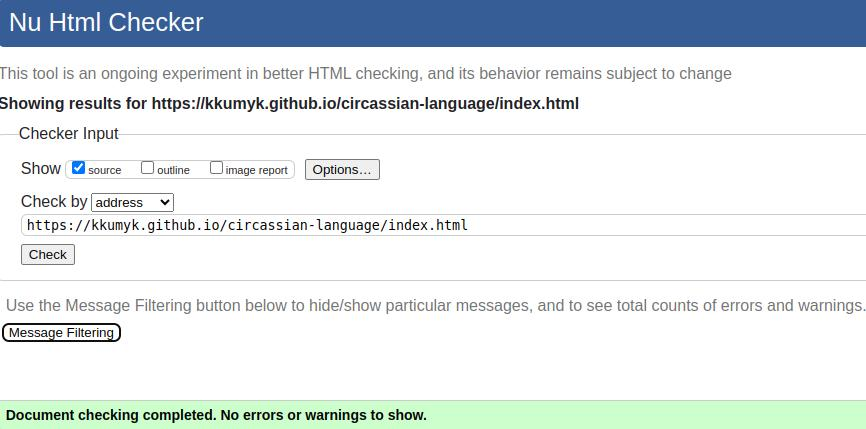
 
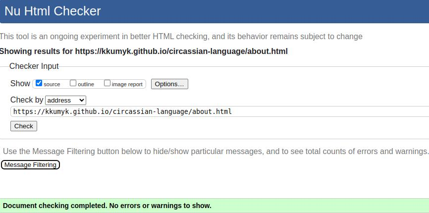
 
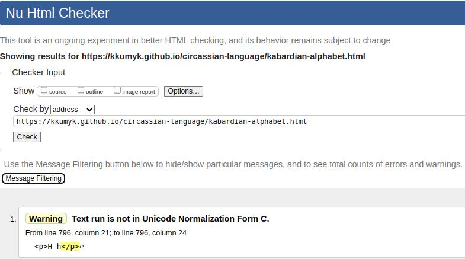
 
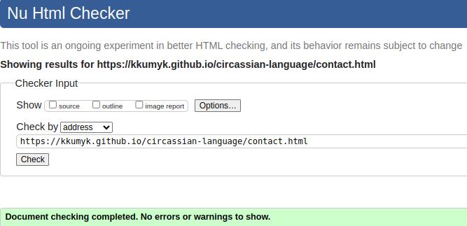

#### Comments
The warnings on the [Kabardian Alphabet](https://kkumyk.github.io/circassian-language/kabardian-alphabet.html) about special characters needing to be replaced with the Unicode are taken notes of and will be added at the later stage. 

## CSS Validation

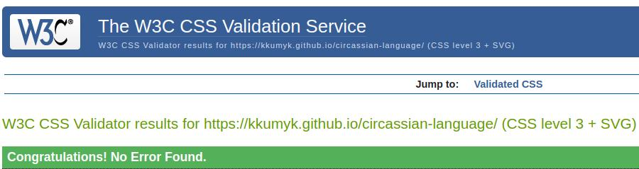
 
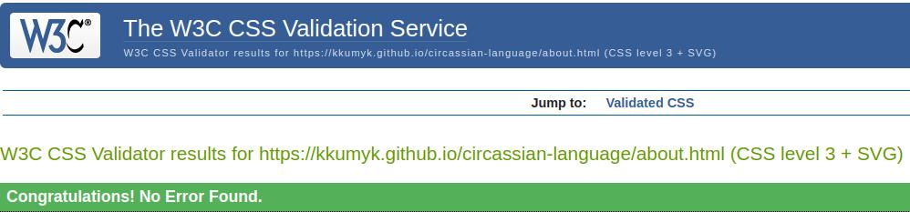
 
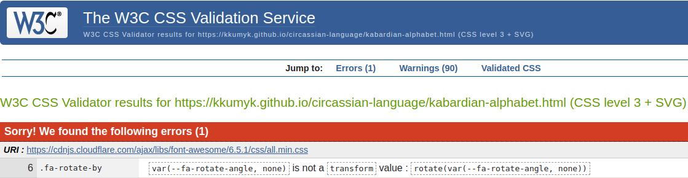
 
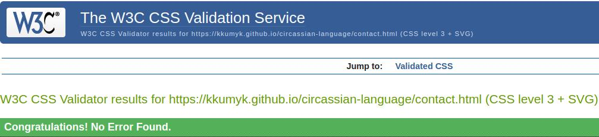

#### Comments
The CSS error on the alphabet page is coming from the imported <strong><italic>css/all.min.css</italic></strong> file that is used to load the sound favicon.

## Lighthouse Reports

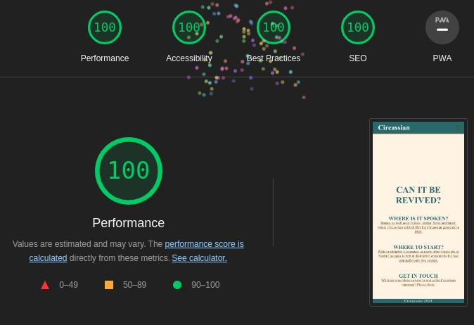
 
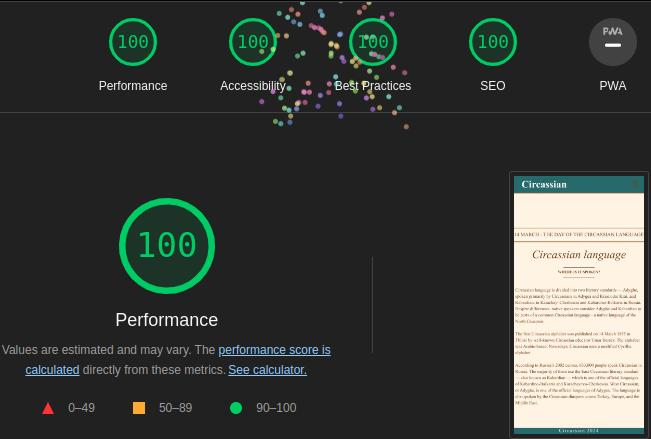
 
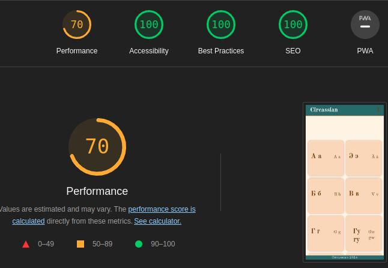
 
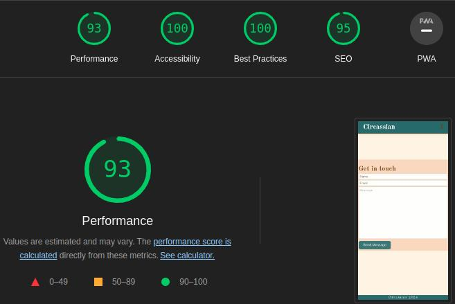

## Tools Used

- [Nu Html Checker](https://validator.w3.org/nu/)
- [CSS Validation Service](https://jigsaw.w3.org/css-validator/)

