# [Circassian Language](https://kkumyk.github.io/circassian-language/)

Circassian Language is created for two purposes:
<ol>
<li>to raise awareness about an endangered language of Circassian, and
 </li>
<li>to create an interactive alphabet as an alternative to the static alphabet pages available online.</li>
</ol>
This project was created using HTML, CSS and JavaScript.

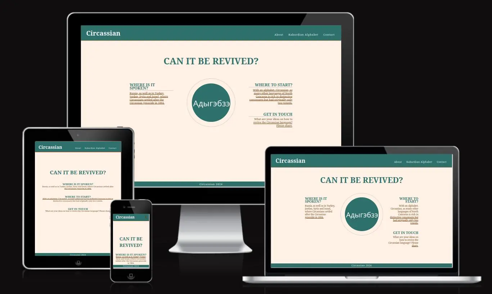

## Table of Contents

## User Experience

### User Stories
The site has two users in mind:
<ol>
<li>Users that know about the existence of the Circassian language.</li>
These are native speakers that for different reasons stopped speaking this language and are looking for an online material to get re-engaged with it.

<li>Users that don't know anything about it.</li>
In this case, the goal of the landing page is to help them to quickly of orientate themselves on the site by delivering the main information about the topic. Subheadings in the question format are used for this purpose.
</oi>

## Design

### Main Colours
The colours chosen for this project are related to the colours characteristic for Circassian people. E.g.: green is the colour of the <a href="https://en.wikipedia.org/wiki/Circassian_flag#:~:text=It%20consists%20of%20a%20green,the%20designer%20of%20the%20flag.">Circassian flag</a>. It also represents these peoples' connection to nature and the role it is playing in their culture. For this purpose, many words chosen for the alphabet are related to nature, such as animal names.

<!-- $$\color{#2d706c}Colours \space \color{#704214}Used \space \color{#704214}On\space The \space \color{#FFF1E5}Site:$$ -->

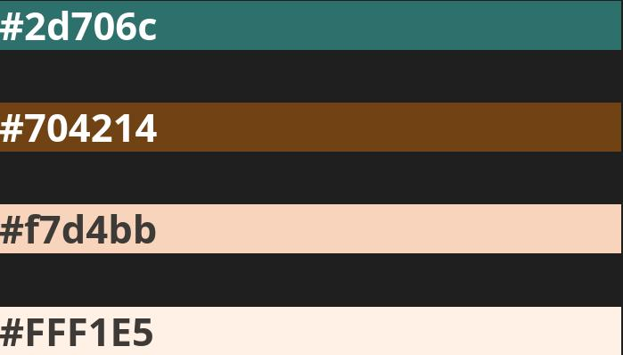

## Features

### Hub Page
The purpose of the Hub page is to give an overview of the site's contents.
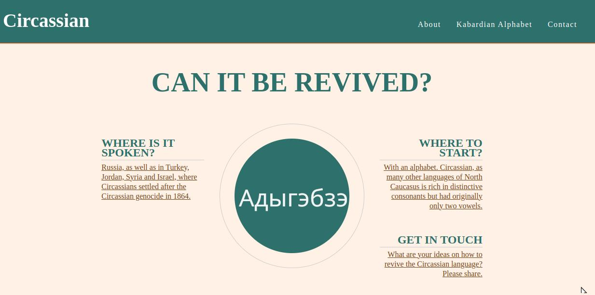

The About page is created in a newspaper style featuring the main challenges the Circassian language is currently facing. 

The Kabardian Alphabet page introduces one of the standards used for the Circassian language - the Kabardian - and lists the letters and word examples in both, Cyrillic and Latin, accompanied by their sounds.

The Contact page provides an option to to connect with people concerned with the challenged the Circassian language is facing and share feedback and ideas.

## Future Features
Two features are planned for the site:
<ol>
  <li>an option to navigate through the letters groups starting with the same latin letter on the Alphabet page with the keyboard</li>
  <li>an interactive page with a poem in Kabardian that will allow to take user's voice input and compare it with the recording done by a native speaker; the result of this interaction will be a calculated score that will represent the pronunciation accuracy.</li>
</ol>

## Testing

## HTML Validation
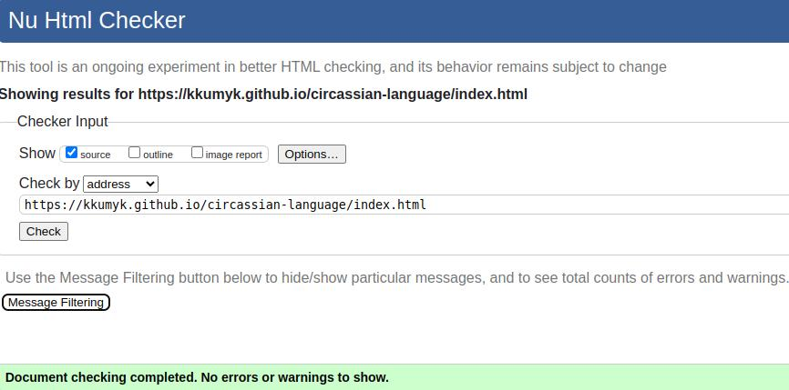
 
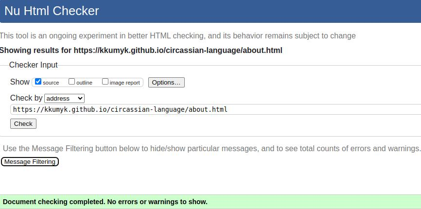
 
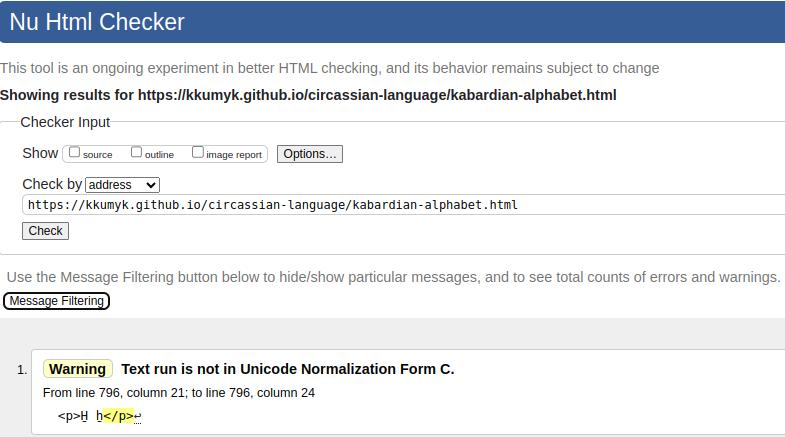
 
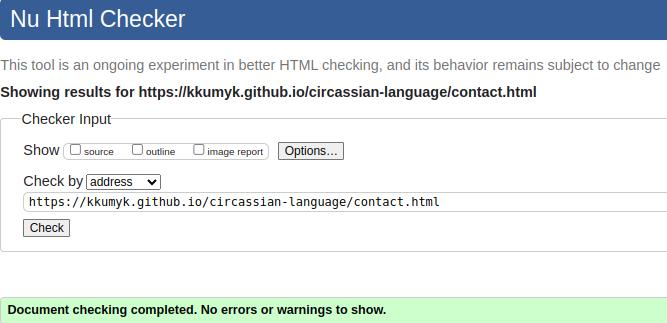

#### Comments
The warnings on the [Kabardian Alphabet](https://kkumyk.github.io/circassian-language/kabardian-alphabet.html) about special characters needing to be replaced with the Unicode are taken notes of and will be added at the later stage. 

## CSS Validation

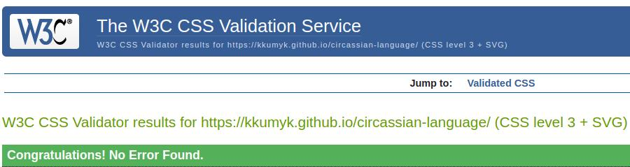
 
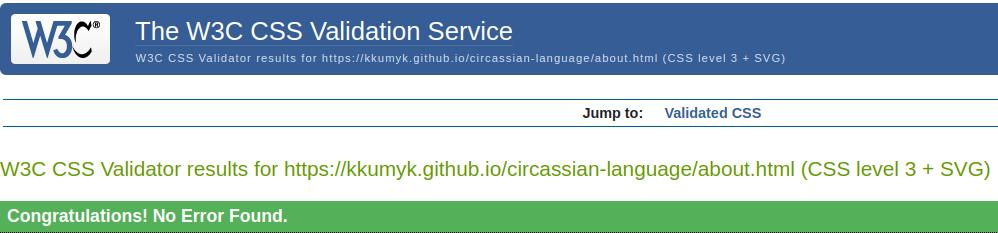
 
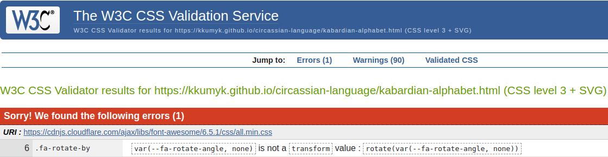
 
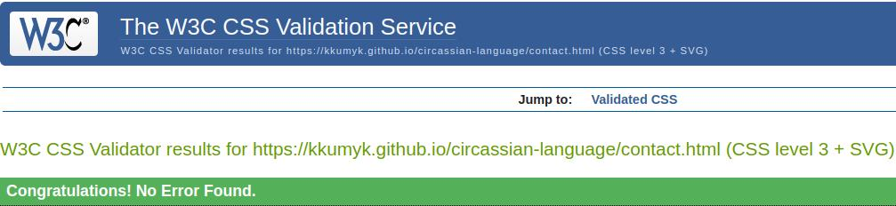

#### Comments
The CSS error on the alphabet page is coming from the imported <strong><italic>css/all.min.css</italic></strong> file that is used to load the sound favicon.

## Lighthouse Reports

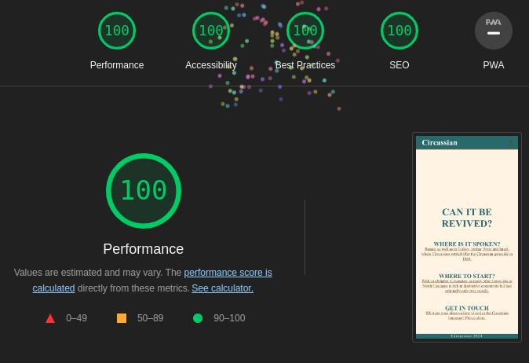
 
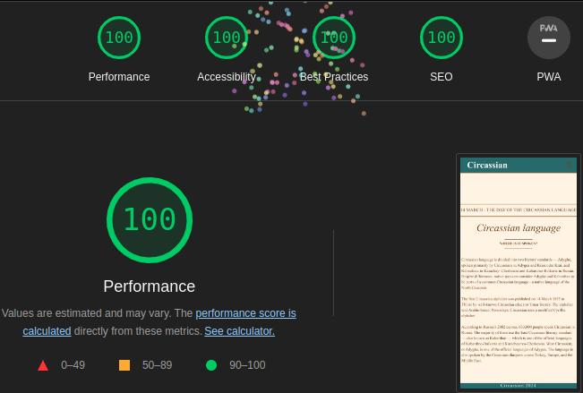
 
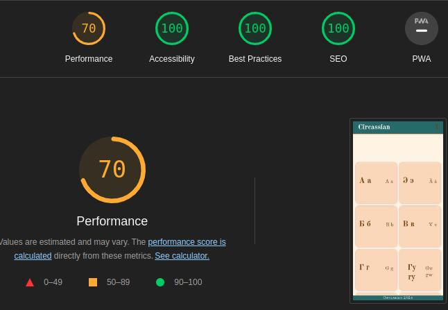
 
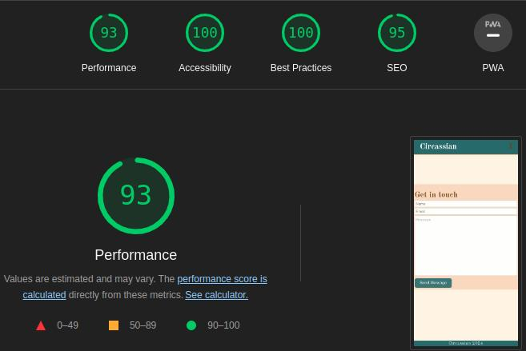

## Tools Used

- [Nu Html Checker](https://validator.w3.org/nu/)
- [CSS Validation Service](https://jigsaw.w3.org/css-validator/)

  
Further Improvements

    - style nav bar so that it is clear where you are - on which page
    - add favicons for standard devices
        <link rel="apple-touch-icon" sizes="180x180" href="assets/favicon/apple-touch-icon.png">
        <link rel="icon" type="image/png" sizes="32x32" href="assets/favicon/favicon-32x32.png">
        <link rel="icon" type="image/png" sizes="16x16" href="assets/favicon/favicon-16x16.png">
    - add 404 page
    - add animation to the hub: the logo text and the text in the circle will be switching to indicate that this is the same text

