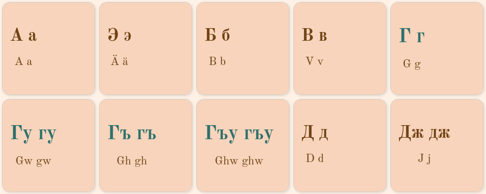

<!-- <a href="" target="_blank"></a> -->
# CIRCASSIAN LANGUAGE

This site is dedicated to the Circassian language and is created for two main purposes:
<ol>
<li>to raise awareness about the challenges this language is currently facing, and</li>
<li>to introduce an interactive alphabet as an alternative to the static pages available online.</li>
</ol>
This site was built using HTML, CSS and JavaScript: <a href="https://kkumyk.github.io/circassian-language/" target="_blank">DEPLOYED SITE</a>


## Table of Contents
<ol>
<li><a href="#user-stories">User Stories</a></li>
<li><a href="#design">Design</a></li>
<li><a href="#features">Features</a></li>
<li><a href="#testing">Testing</a></li>
<li><a href="#technologies">Technologies</a></li>
<li><a href="#credits">Credits</a></li>
<li><a href="#future-features">Future Features</a></li>
<li><a href="#further-improvements">Further Improvements</a></li>
</ol>

### User Stories

#### I. User that is familiar with the Circassian language

These are native speakers that for different reasons stopped speaking the language and are looking for an online material to get re-engaged with it.
<ul>
<li>As a user, I want to quickly get an overview of the material the site is offering.</li>
<li>As a user, I want to understand how this site can help me to re-engage with the language and how exactly it can be used for this purpose.</li>
</ul>

#### II. User that is unaware of the existence of the Circassian language
The user did most likely land on the site by accident as this was not a result of an intentional search.
<ul>
<li>As a user, I want easily understand the main purpose of the website.</li>
</ul>


## Design

### Colours
- <font color="#2d706c">Green</font> is used on the site as it is the colour of the <a href="https://en.wikipedia.org/wiki/Circassian_flag#:~:text=It%20consists%20of%20a%20green,the%20designer%20of%20the%20flag." target="_blank">Circassian flag</a>: #2d706c

- <span style="color:#704214">Text: #704214</span>
- <span style="color:#f7d4bb">Background colour for container boxes: #f7d4bb</span>
- <span style="color:#FFF1E5">Background colour for pages: #FFF1E5</span>


## Features

### Hub page
The purpose of the Hub page is to give an overview of the site's contents.


### About page
The About page is created in a newspaper style featuring the main challenges the Circassian language is currently facing.


### Alphabet page
This page introduces one of the standards used for the Circassian language - the Kabardian and lists the letters and word examples in both, Cyrillic and Latin, accompanied by their sounds.


Letters in Cyrillic starting with the same letter in Latin transcription can be highlighted via keyboard. Letters marked up as belonging to one group will change their size and text colour when a corresponding keyboard key is pressed.



### Read and Record a Poem page
On this page the user can listen to a poem read by two native speakers. They can also read the poem and record their voice.

 

### Contact page
The Contact page provides an option to connect with people concerned about the challenged the Circassian language is facing and share feedback and ideas on how to preserve it.


## Testing
Please refer to [TESTING.md](doc/testing/TESTING.md) file for:
- Validation of all languages
- PageSpeed Insights scores
- Manual Testing, Accessibility and Bugs

## Technologies

- [HTML](https://web.dev/learn/html/overview/) was used to provide structure for this project and highlight the semantic elements of tits content.
- [CSS](https://developer.mozilla.org/en-US/docs/Web/CSS) was used to style the HTML elements.
- [JavaScript](https://developer.mozilla.org/en-US/docs/Web/JavaScript) was used to add sounds to the site.
- [GitHub](https://github.com/) is the hosting site used to store the code for the website.
- [Git](https://git-scm.com/) was used as a version control software to commit and push the code to the GitHub repository.
- [Google Fonts](https://fonts.google.com/) was used to import fonts.
- [GIMP](https://www.gimp.org/) was used to create favicon for the site.
- [WEBP Converter](https://convertio.co/webp-converter/) used to convert images to webp format.
- [Google Chrome Lighthouse](https://developer.chrome.com/docs/lighthouse/overview/) was used during the testing of the website.
- [Google Chrome Developer Tools](https://developer.chrome.com/docs/devtools/overview/) was used during testing, debugging and making the website responsive.
- [W3C HTML Validator](https://validator.w3.org/nu/) was used to check for errors in the HTML code.
- [W3C CSS Validator](https://jigsaw.w3.org/css-validator/) was used to check for errors in the CSS code.
- [FabForm](https://fabform.io/) used for backend on the contact form.
- [Balsamiq](https://balsamiq.com/) used to create wire frames.
- [Am I Responsive](https://ui.dev/amiresponsive) used to generate site's appearances on different devices and to check its responsiveness on them. 

## Credits

### Media

- [Father Drawing](https://www.timesnownews.com/web-stories/viral/8-easy-yet-captivating-fathers-day-drawing-ideas-for-kids-to-try-in-2023/photostory/101048907.cms) for the alphabet page.

### Content
The content on the About page is based on the sources below:
- Open Caucasus Media, [Activists mark Circassian Language Day in Russia and Georgia](https://oc-media.org/activists-mark-circassian-language-day-in-russia-and-georgia/)
- Open Caucasus Media, [Vulnerable and divided: the uncertain state of the Circassian language](https://oc-media.org/features/vulnerable-and-divided-the-uncertain-state-of-the-circassian-language/)
- [A story about how the Kabardian language is getting forgotten](https://www.youtube.com/watch?v=emIvYbCygKM&t=24s)
- [A Grammar of the Kabardian Language by J Colarusso](https://library.oapen.org/bitstream/id/eb3cef03-30c0-4571-b5b3-11be2cd4f9e3/9781552386682.pdf)

### Voice Cover

- [adyghabza playlist](https://www.youtube.com/watch?v=r_qQCUDaz-I): letters and poem recordings
- [amaltus.com](https://amaltus.com/%D0%BA%D0%B0%D0%B1%D0%B0%D1%80%D0%B4%D0%B8%D0%BD%D1%81%D0%BA%D0%B8%D0%B9-%D0%B0%D0%BB%D1%84%D0%B0%D0%B2%D0%B8%D1%82-%D0%B0%D1%83%D0%B4%D0%B8%D0%BE/): some word recordings
- [Kabardian Phrases](https://archive.org/details/KabardianPhrases/whom+do+you+prefer+among+Circassian+writers.mp3): some word recordings

### Code
- Parts of the HTML and CSS was borrowed from the Code Institute's [Love Running](https://code-institute-org.github.io/love-running-2.0/index.html) main page.
- [Newspaper Style Design by Silke V](https://codepen.io/silkine/pen/QWBxVX) was used on the About page.
- [Mic Button Animation and Audio Recording Functionality](https://www.youtube.com/watch?v=3OnMBtOyGkY&themeRefresh=1) on the [Read and Record a Poem](https://kkumyk.github.io/circassian-language/read-poem-in-kabardian.html) page were adapted from the Youtube tutorial by [Tyler Potts](https://github.com/TylerPottsDev).

## Future Features
Two features are planned for the site:
<ol>
  <li>an option to navigate through the letters groups starting with the same latin letter on the Alphabet page with the keyboard</li>
  <li>an interactive page with a poem in Kabardian that will allow to take user's voice input and compare it with the recording done by a native speaker; the result of this interaction will be a calculated score that will represent the pronunciation accuracy.</li>
</ol>

## Further Improvements
<ul>
<li>style nav bar so that it is clear where you are - on which page</li>
<li>add favicons for sises below:

```
<link rel="apple-touch-icon" sizes="180x180" href="assets/favicon/apple-touch-icon.png">

<link rel="icon" type="image/png" sizes="32x32" href="assets/favicon/favicon-32x32.png">
```
</li>

<li>add 404 page</li>
<li>add animation to the hub: the logo text and the text in the circle will be switching to indicate that this is the same text</li>

<li>create and add the remaining images to the alphabet letters</li>

<li>replace special characters with their corresponding unicodes</li>
</ul>

<details>
  <summary>WIP</summary>
  
https://stackoverflow.com/questions/62846354/calculate-the-percentage-of-accuracy-with-which-user-made-the-assigned-sound

https://cohenpr-xpf.github.io/XPF/conv_resources/info/kbd.html

https://cohenpr-xpf.github.io/XPF/Convert-to-IPA.html

## IPA
A tool for transcribing orthographic text as IPA (International Phonetic Alphabet) incl Kabardian
[epitran](https://github.com/dmort27/epitran)

https://github.com/persephone-tools/persephone


https://stackoverflow.com/questions/68489707/
is-there-a-python-library-i-could-use-to-convert-audio-to-phonemes

https://stackoverflow.com/questions/30705028/convert-sound-to-list-of-phonemes-in-python

https://github.com/xinjli/allosaurus

https://github.com/crim-ca/speech_to_phonemes?tab=readme-ov-file

https://github.com/ASR-project/Multilingual-PR


https://github.com/AdolfVonKleist/Phonetisaurus


https://espeak.sourceforge.net/


https://github.com/topics/low-resource-languages?l=python

https://github.com/RichardLitt/low-resource-languages?tab=readme-ov-file#automatic-speech-recognition-asr


https://elpis.readthedocs.io/en/latest/


https://www.reddit.com/r/linguistics/comments/7xnq4o/text_to_speech_for_dying_language/

https://deepmind.google/discover/blog/wavenet-a-generative-model-for-raw-audio/


https://www.lti.cs.cmu.edu/research/dissertations/2023/xinjianl_phd_lti_2023.pdf


A SHORT GRAMMAR OF EAST CIRCASSIAN (KABARDIAN)

https://circassianworld.com/pdf/A_Grammar_of_East_Circassian_Kabardian.pdf


## Audio Recorder with JS


https://github.com/Adityapanther/Audio-Recorder-App-in-Vanilla-javascript

https://javascript.plainenglish.io/an-ultimate-guide-to-voice-recording-with-javascript-119e505780cd

https://github.com/vocaroo/simple-audio-recorder

https://www.youtube.com/watch?v=sbf6vQ8xym4

https://miguelvieira.io/projects/KVFUHZVl0AZQhlKy27nn/videos/zZn0l7JTLbW3Vysl6QCm

https://www.youtube.com/watch?v=B3wWIsNHPk4

https://github.com/markjivko/markjivko.github.io/blob/master/tutorials/B3wWIsNHPk4/index.html

https://www.youtube.com/watch?v=3OnMBtOyGkY

https://www.youtube.com/watch?v=sbf6vQ8xym4

https://www.youtube.com/watch?v=VwaR2VkvpzM

## Flexbox template

https://stackoverflow.com/questions/33947885/left-column-and-stacked-right-column-using-flexbox-css
https://codepen.io/dloewen/pen/qOzogG

## Audio button
https://stackoverflow.com/questions/27368778/how-to-toggle-audio-play-pause-with-one-button-or-link

## Poem Translation
https://lingvoforum.net/index.php/topic,8655.100.html?PHPSESSID=7075c0dbcd46a3312d74c86e6de9a7cd


</details>

